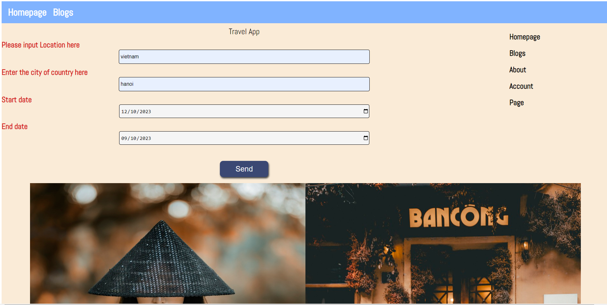

# Udacity Project 4: Natural Language Processing

## Overview

This project allow users to run Natural Language Processing (NLP) on other websites by the help of MeaningCloud API.
You can check the decumentation [here](https://learn.meaningcloud.com/developer/sentiment-analysis/2.1/doc/examples)

**The goal of this project is to give you practice with:**

- Setting up Webpack
- Webpack Loaders and Plugins
- HTML, JavaScript
- Sass
- Calling APIs
- Service workers

## Getting started

Before start running the tool, you have to download the dependency packages to make sure the tool will work.

The installation command is:

```
npm install
```

Use the following command to start the developer server. This should open a new window in your browser with the app running on localhost:8080

```
npm run build-dev
```

You can also run the production server:

```
npm run build-pro
npm run start
```

The first command will create a `dist` folder with the built code.

## Preview


